<div align="center">

# 🏦 Banking Modern Data Stack (MDS)
### End-to-End Real-Time CDC, Lakehouse Ingestion, Snowflake Data Warehouse & dbt Analytics

[](https://github.com/Vinay9222/banking-modern-datastack/actions/workflows/ci.yml)
[](https://github.com/Vinay9222/banking-modern-datastack/actions/workflows/cd.yml)
[](https://www.python.org/)
[](https://www.postgresql.org/)
[](https://kafka.apache.org/)
[](https://debezium.io/)
[](https://min.io/)
[](https://airflow.apache.org/)
[](https://www.snowflake.com/)
[](https://www.getdbt.com/)
[](https://github.com/astral-sh/ruff)
[](LICENSE)

<p align="center">
  <b>A production-grade, event-driven data engineering architecture for banking and fintech workloads.</b><br>
  Captures real-time OLTP changes with CDC, buffers via Kafka, stores partitioned Parquet in MinIO S3, orchestrates scheduled micro-batches to Snowflake with Airflow, and builds Medallion-architected SCD Type 2 data marts using dbt.
</p>

[Architecture](#-architecture-overview) •
[Data Flow](#-end-to-end-data-flow) •
[Tech Stack](#-technology-stack) •
[Data Models](#-data-modeling--medallion-architecture) •
[Quickstart](#-step-by-step-quickstart) •
[CI/CD](#-cicd-pipeline--automation) •
[Testing](#-testing--quality-assurance)

</div>

---

## 📖 Table of Contents
- [Executive Summary](#-executive-summary)
- [Architecture Overview](#-architecture-overview)
- [End-to-End Data Flow](#-end-to-end-data-flow)
- [Technology Stack](#-technology-stack)
- [Repository Structure](#-repository-structure)
- [Data Modeling & Medallion Architecture](#-data-modeling--medallion-architecture)
  - [Bronze Layer (Raw Storage)](#1-bronze-layer-raw-ingestion)
  - [Silver Layer (Staging Views & Deduplication)](#2-silver-layer-staging-views)
  - [Gold Layer (Dimensions SCD2 & Fact Tables)](#3-gold-layer-marts--star-schema)
- [Step-by-Step Quickstart](#-step-by-step-quickstart)
  - [1. Prerequisites](#1-prerequisites)
  - [2. Environment Configuration](#2-environment-configuration)
  - [3. Start Docker Services](#3-start-docker-services)
  - [4. Initialize Postgres OLTP Schema](#4-initialize-postgres-oltp-schema)
  - [5. Register Debezium CDC Connector](#5-register-debezium-cdc-connector)
  - [6. Stream Mock Banking Transactions](#6-stream-mock-banking-transactions)
  - [7. Run Kafka-to-MinIO Parquet Consumer](#7-run-kafka-to-minio-parquet-consumer)
  - [8. Orchestrate via Apache Airflow](#8-orchestrate-via-apache-airflow)
  - [9. Execute & Test dbt Transformations](#9-execute--test-dbt-transformations)
- [Environment Variables Reference](#-environment-variables-reference)
- [CI/CD Pipeline & Automation](#-cicd-pipeline--automation)
- [Testing & Quality Assurance](#-testing--quality-assurance)
- [Troubleshooting & FAQ](#-troubleshooting--faq)
- [License](#-license)

---

## 🎯 Executive Summary

In financial institutions and fintech ecosystems, transactional data is generated continuously across user accounts, fund transfers, deposits, and profile updates. Traditional batch extraction (e.g. daily cron dumps) introduces high latency, database locks, and risks missing intra-day state transitions.

This project implements an enterprise-grade **Modern Data Stack (MDS)** with the following core design goals:
1. **Zero-Impact OLTP Ingestion:** Uses PostgreSQL Write-Ahead Log (WAL) logical replication with Debezium CDC to capture changes with sub-second latency and zero query overhead on the source database.
2. **Decoupled & Resilient Streaming:** Uses Apache Kafka to buffer burst transactions, preventing downstream systems from becoming overwhelmed.
3. **Cost-Efficient Object Lakehouse:** Batches change streams into columnar **Parquet format** and lands them in **MinIO S3**, partitioned by table and date (`{table}/date=YYYY-MM-DD/`).
4. **Reliable Cloud Orchestration:** Uses **Apache Airflow** DAGs to stage and load Parquet files into **Snowflake** tables using high-throughput `COPY INTO` bulk loading.
5. **Medallion Modeling with SCD Type 2:** Uses **dbt (data build tool)** to build curated Bronze $\rightarrow$ Silver $\rightarrow$ Gold data layers with **Slowly Changing Dimensions (SCD Type 2)** snapshots to audit account balance and customer profile history over time.
6. **Automated Governance & Quality:** Enforces schema integrity, automated testing (Pytest), linter checks (Ruff), and CI/CD deployment via GitHub Actions.

---

## 🏛️ Architecture Overview

```mermaid
flowchart LR
    subgraph S1 ["1. OLTP Database"]
        direction TB
        DB[(PostgreSQL 15\nBanking DB)]
        GEN[Mock Data Generator\nPython + Faker] -->|Inserts / Updates| DB
    end

    subgraph S2 ["2. Streaming & CDC"]
        direction TB
        DEB[Debezium Connect\npgoutput plugin]
        KAFKA[[Apache Kafka\nTopics Cluster]]
        DB -.->|WAL Logical Logs| DEB
        DEB -->|JSON Events| KAFKA
    end

    subgraph S3 ["3. Data Lakehouse"]
        direction TB
        CONS[Kafka Consumer\nPython + Pandas]
        MINIO[("MinIO S3 Lake\nPartitioned Parquet")]
        KAFKA -->|Stream Consume| CONS
        CONS -->|Batched Uploads| MINIO
    end

    subgraph S4 ["4. Orchestration & Warehouse"]
        direction TB
        AIRFLOW[Apache Airflow\nScheduler + Webserver]
        SNOW_RAW[(Snowflake RAW\nStage & Tables)]
        AIRFLOW -->|Download & Stage| MINIO
        AIRFLOW -->|COPY INTO| SNOW_RAW
    end

    subgraph S5 ["5. Analytics Marts (dbt)"]
        direction TB
        DBT[dbt Core\nTransformations]
        STG[Silver Layer\nstg_* Views]
        SNAP[dbt Snapshots\nSCD Type 2]
        MARTS[(Snowflake ANALYTICS\ndim_* & fact_*)]
        SNOW_RAW --> DBT
        DBT --> STG
        STG --> SNAP
        SNAP --> MARTS
    end

    S1 ==> S2
    S2 ==> S3
    S3 ==> S4
    S4 ==> S5

    classDef c1 fill:#E3F2FD,stroke:#1565C0,stroke-width:2px,color:#0D47A1;
    classDef c2 fill:#FFF3E0,stroke:#E65100,stroke-width:2px,color:#BF360C;
    classDef c3 fill:#FCE4EC,stroke:#C2185B,stroke-width:2px,color:#880E4F;
    classDef c4 fill:#E8F5E9,stroke:#2E7D32,stroke-width:2px,color:#1B5E20;
    classDef c5 fill:#EDE7F6,stroke:#512DA8,stroke-width:2px,color:#311B92;

    class S1 c1;
    class S2 c2;
    class S3 c3;
    class S4 c4;
    class S5 c5;
```



---

## 🔄 End-to-End Data Flow

| Stage | Process | Input | Output / Destination | Frequency |
| :--- | :--- | :--- | :--- | :--- |
| **1. Transaction Generation** | `faker_generator.py` simulates banking customers, accounts, and transactions. | Python CLI | PostgreSQL tables: `customers`, `accounts`, `transactions` | Real-time / Continuous |
| **2. Change Data Capture** | Debezium captures row-level inserts and updates via Postgres `wal_level=logical`. | PostgreSQL WAL | Kafka topics: `banking_server.public.*` | Real-time (<1 sec) |
| **3. Stream Ingestion to S3** | `kafka_to_minio.py` consumes JSON CDC messages and batches them into Parquet. | Kafka Topics | MinIO bucket: `s3://raw/{table}/date=YYYY-MM-DD/*.parquet` | Micro-batch |
| **4. Cloud Data Loading** | Airflow DAG `minio_to_snowflake_banking` stages files and executes `COPY INTO`. | MinIO Parquet | Snowflake `RAW.CUSTOMERS`, `RAW.ACCOUNTS`, `RAW.TRANSACTIONS` | Every 5 minutes |
| **5. Staging & Deduplication** | dbt models parse JSON/VARIANT payloads and deduplicate latest states via window ranking. | Snowflake `RAW` | Snowflake views: `stg_customers`, `stg_accounts`, `stg_transactions` | Automated / Scheduled |
| **6. SCD2 & Dimensional Marts** | dbt snapshots track historical attribute changes; dimensional models generate analytics star schema. | dbt Staging | Snowflake `ANALYTICS`: `dim_customers`, `dim_accounts`, `fact_transactions` | Scheduled / Daily |

---

## 💻 Technology Stack

| Technology | Layer | Component / Image | Port(s) | Description & Purpose |
| :--- | :--- | :--- | :--- | :--- |
| **PostgreSQL** | Source OLTP | `postgres:15` | `5432` | Source transactional banking database with logical replication enabled. |
| **Apache Zookeeper** | Coordination | `confluentinc/cp-zookeeper:7.4.0` | `2181` | Centralized service for maintaining configuration and broker state for Kafka. |
| **Apache Kafka** | Streaming Broker | `confluentinc/cp-kafka:7.4.1` | `9092`, `29092` | High-throughput distributed event log buffering CDC messages. |
| **Debezium Connect** | CDC Engine | `debezium/connect:2.2` | `8083` | Kafka Connect framework streaming row-level Postgres changes into Kafka topics. |
| **MinIO** | Object Lakehouse | `minio/minio:latest` | `9000` (API), `9001` (UI) | High-performance, S3-compatible object storage storing partitioned Parquet files. |
| **Apache Airflow** | Orchestration | Custom `apache/airflow:2.9.3` | `8080` (UI), `5433` (Meta DB)| Workflow scheduler orchestrating lake ingestion and transformation pipelines. |
| **Snowflake** | Cloud Warehouse | Cloud PaaS (`COMPUTE_WH`) | Cloud | Scalable cloud data warehouse hosting raw landing tables and analytics marts. |
| **dbt Core** | Transformation | `dbt-core` + `dbt-snowflake` | CLI | Transforms raw data into dimensional models with data tests and SCD Type 2 tracking. |
| **Python & Ruff** | Code & Quality | Python 3.11+, Ruff, Pytest | Local / CI | Data generator, consumer scripts, fast linter, and automated test runners. |
| **GitHub Actions** | CI/CD | `ubuntu-latest` | Cloud | Automated CI validation (Ruff, Pytest, dbt compile) and production CD deployments. |

---

## 📁 Repository Structure

```text
banking-modern-datastack/
├── .github/
│   └── workflows/
│       ├── ci.yml                     # CI: Ruff linting, Pytest unit tests, dbt compile
│       └── cd.yml                     # CD: Automated dbt production deployment & testing
├── banking_dbt/                       # dbt Transformation Project
│   ├── dbt_project.yml                # dbt project definition & clean targets
│   ├── profiles.yml                   # Profile configuration using env_var() macros
│   ├── profiles.yml.example           # Reference profile template for developers
│   ├── models/
│   │   ├── source.yml                 # Source declarations for Snowflake RAW tables
│   │   ├── staging/                   # Silver Layer: Staging views & deduplication
│   │   │   ├── schema.yml             # Staging tests (unique, not_null) & documentation
│   │   │   ├── stg_accounts.sql       # Deduplicated accounts staging view
│   │   │   ├── stg_customers.sql      # Deduplicated customers staging view
│   │   │   └── stg_transactions.sql   # Deduplicated transactions staging view
│   │   └── marts/                     # Gold Layer: Star schema & dimensional models
│   │       ├── schema.yml             # Marts tests, integrity checks & column docs
│   │       ├── dimensions/
│   │       │   ├── dim_accounts.sql   # SCD2 Dimension for bank accounts
│   │       │   └── dim_customers.sql  # SCD2 Dimension for customers
│   │       └── facts/
│   │           └── fact_transactions.sql # Incremental transaction fact table
│   └── snapshots/
│       ├── accounts_snapshot.sql      # dbt SCD Type 2 snapshot for accounts
│       └── customers_snapshot.sql     # dbt SCD Type 2 snapshot for customers
├── consumer/
│   └── kafka_to_minio.py              # Kafka consumer streaming Parquet batches to MinIO
├── data-generator/
│   └── faker_generator.py             # Realistic banking data generator (Faker + psycopg2)
├── docker/
│   └── dags/                          # Apache Airflow DAGs
│       ├── minio_to_snowflake_dag.py  # MinIO S3 -> Snowflake RAW automated ingestion
│       └── scd_snapshots.py           # dbt SCD2 snapshot execution & marts builder DAG
├── kafka-debezium/
│   └── generate_and_post_connector.py # Debezium PostgreSQL connector deployment script
├── postgres/
│   └── schema.sql                     # PostgreSQL banking OLTP schema definitions
├── tests/                             # Test Suite for CI Verification
│   ├── test_generator_utils.py        # Unit tests for data generation & money math
│   └── test_pipeline_configs.py       # Unit tests verifying schemas & dbt configurations
├── .env.example                       # Documented environment variable template
├── .gitignore                         # Comprehensive rules ignoring caches, logs & secrets
├── docker-compose.yml                 # Multi-container stack (Zookeeper, Kafka, MinIO, Airflow)
├── dockerfile-airflow.dockerfile      # Custom Airflow image with dbt-snowflake preinstalled
├── requirements.txt                   # Categorized Python dependencies
├── LICENSE                            # Open-source MIT License
└── README.md                          # Comprehensive project documentation
```

---

## 📊 Data Modeling & Medallion Architecture

```
                                  ┌───────────────────────────────┐
                                  │         SOURCE OLTP           │
                                  │ PostgreSQL (customers,       │
                                  │ accounts, transactions)       │
                                  └───────────────┬───────────────┘
                                                  │ (Debezium CDC + Kafka + MinIO)
                                                  ▼
┌─────────────────────────────────────────────────────────────────────────────────────────────────┐
│ BRONZE LAYER (Snowflake RAW Schema)                                                             │
│ - RAW.CUSTOMERS    : Raw JSON/VARIANT payloads ingested from S3 Parquet                         │
│ - RAW.ACCOUNTS     : Raw JSON/VARIANT payloads ingested from S3 Parquet                         │
│ - RAW.TRANSACTIONS : Raw JSON/VARIANT payloads ingested from S3 Parquet                         │
└────────────────────────────────────────────────┬────────────────────────────────────────────────┘
                                                 │ (dbt staging transformations & window deduplication)
                                                 ▼
┌─────────────────────────────────────────────────────────────────────────────────────────────────┐
│ SILVER LAYER (dbt Staging Views)                                                                │
│ - stg_customers    : Parsed fields, timestamp normalization, deduplication via RANK()          │
│ - stg_accounts     : Parsed fields, cast types (NUMERIC), latest balance state via ROW_NUMBER() │
│ - stg_transactions : Parsed financial events, status casting, deduplicated by transaction_id   │
└────────────────────────────────────────────────┬────────────────────────────────────────────────┘
                                                 │ (dbt snapshots & star schema modeling)
                                                 ▼
┌─────────────────────────────────────────────────────────────────────────────────────────────────┐
│ GOLD LAYER (Snowflake ANALYTICS Schema)                                                         │
│                                                                                                 │
│  ┌──────────────────────────────┐              ┌─────────────────────────────────────────────┐  │
│  │   dim_customers (SCD2)       │              │           dim_accounts (SCD2)               │  │
│  │  - customer_id (PK)          │              │  - account_id (PK)                          │  │
│  │  - first_name, last_name     │              │  - customer_id (FK)                         │  │
│  │  - email                     │              │  - account_type, balance, currency         │  │
│  │  - effective_from            │              │  - effective_from, effective_to             │  │
│  │  - effective_to, is_current  │              │  - is_current                               │  │
│  └──────────────┬───────────────┘              └──────────────────────┬──────────────────────┘  │
│                 │                                                     │                         │
│                 └───────────────────────┐     ┌───────────────────────┘                         │
│                                         ▼     ▼                                                 │
│                              ┌────────────────────────────────────────┐                         │
│                              │       fact_transactions (Incremental)  │                         │
│                              │  - transaction_id (PK)                 │                         │
│                              │  - account_id (FK -> dim_accounts)     │                         │
│                              │  - customer_id (FK -> dim_customers)   │                         │
│                              │  - amount, transaction_type, status    │                         │
│                              │  - transaction_time, load_timestamp    │                         │
│                              └────────────────────────────────────────┘                         │
└─────────────────────────────────────────────────────────────────────────────────────────────────┘
```

### 1. Bronze Layer (Raw Ingestion)
- Loaded directly from MinIO Parquet files using Airflow and Snowflake's `COPY INTO` command.
- Stores ingested data in raw tables (`RAW.CUSTOMERS`, `RAW.ACCOUNTS`, `RAW.TRANSACTIONS`).

### 2. Silver Layer (Staging Views)
- **`stg_customers`:** Extracts individual columns from raw payloads, converts timestamps, and deduplicates using `RANK() OVER (PARTITION BY customer_id ORDER BY created_time)`.
- **`stg_accounts`:** Casts account balances to float/numeric, extracts currency, and eliminates duplicate events using `ROW_NUMBER() OVER (PARTITION BY account_id ORDER BY created_at DESC)`.
- **`stg_transactions`:** Parses monetary transaction amounts, types (`DEPOSIT`, `WITHDRAWAL`, `TRANSFER`), and statuses, removing redundant events.

### 3. Gold Layer (Marts / Star Schema)
- **Slowly Changing Dimensions (SCD Type 2):**
  - **`dim_customers`:** Powered by `accounts_snapshot.sql` using dbt's `check` strategy to track historical modifications to customer names and email addresses with `effective_from`, `effective_to`, and `is_current` flags.
  - **`dim_accounts`:** Tracks historical changes to account balances and account types over time.
- **Incremental Fact Table (`fact_transactions`):**
  - Materialized incrementally on `transaction_id`.
  - Enriched with `customer_id` by joining `stg_transactions` with `stg_accounts`.
  - Only processes records newer than `MAX(transaction_time)` on subsequent runs.

---

## ⚡ Step-by-Step Quickstart

### 1. Prerequisites
Ensure you have the following installed on your host system:
- [Docker](https://docs.docker.com/get-docker/) & [Docker Compose](https://docs.docker.com/compose/)
- [Python 3.10+](https://www.python.org/downloads/)
- Active [Snowflake Account](https://signup.snowflake.com/) (Trial or Standard Edition)

---

### 2. Environment Configuration
Clone the repository and prepare your environment:

```bash
# Clone repository
git clone https://github.com/Vinay9222/banking-modern-datastack.git
cd banking-modern-datastack

# Create your local .env configuration from the template
cp .env.example .env

# Create and activate Python virtual environment
python -m venv .venv
source .venv/bin/activate    # On Windows: .venv\Scripts\activate

# Install Python requirements
pip install -r requirements.txt
```

Open `.env` and fill in your **Snowflake credentials**:
```ini
SNOWFLAKE_ACCOUNT=your_snowflake_account_identifier
SNOWFLAKE_USER=your_snowflake_username
SNOWFLAKE_PASSWORD=your_snowflake_password
SNOWFLAKE_WAREHOUSE=COMPUTE_WH
SNOWFLAKE_DB=BANKING
SNOWFLAKE_SCHEMA=RAW
```

---

### 3. Start Docker Services
Launch the entire local data platform via Docker Compose:

```bash
docker compose up -d
```

Check the status of the containers:
```bash
docker compose ps
```

| Service | Endpoint | Default Credentials |
| :--- | :--- | :--- |
| **Airflow Webserver** | [http://localhost:8080](http://localhost:8080) | `admin` / `admin` |
| **MinIO Web Console** | [http://localhost:9001](http://localhost:9001) | `minioadmin` / `minioadmin` |
| **MinIO S3 API** | `http://localhost:9000` | `minioadmin` / `minioadmin` |
| **Debezium Connect REST API** | [http://localhost:8083](http://localhost:8083) | _None_ |
| **PostgreSQL (OLTP)** | `localhost:5432` | `postgres` / `postgres` |

---

### 4. Initialize Postgres OLTP Schema
Create the banking relational tables (`customers`, `accounts`, `transactions`) in PostgreSQL:

```bash
docker exec -i banking-postgres psql -U postgres -d banking < postgres/schema.sql
```

---

### 5. Register Debezium CDC Connector
Deploy the PostgreSQL Change Data Capture connector to Debezium Connect:

```bash
python kafka-debezium/generate_and_post_connector.py
```

*Expected output:*
```text
[INFO] Submitting Debezium Postgres CDC connector configuration to http://localhost:8083/connectors...
[INFO] Connector 'postgres-connector' registered successfully!
```

---

### 6. Stream Mock Banking Transactions
Generate realistic synthetic banking data (customers, accounts, deposits, withdrawals, transfers):

```bash
# Continuous streaming mode (inserts new transactions every 2 seconds):
python data-generator/faker_generator.py

# Or run a single batch for testing:
python data-generator/faker_generator.py --once
```

---

### 7. Run Kafka-to-MinIO Parquet Consumer
In a new terminal window, start the Kafka consumer that reads CDC change events and writes partitioned Parquet files to the MinIO data lake:

```bash
python consumer/kafka_to_minio.py
```

*Expected output:*
```text
[INFO] Connecting to Kafka at localhost:29092...
[INFO] Connected to Kafka. Listening for CDC messages...
[INFO] Uploaded 50 records to s3://raw/transactions/date=2026-08-14/transactions_204500123456.parquet
```

You can view the generated Parquet files in the **MinIO Console** at [http://localhost:9001](http://localhost:9001) under the `raw` bucket.

---

### 8. Orchestrate via Apache Airflow
Access the Airflow UI at [http://localhost:8080](http://localhost:8080) (login with `admin` / `admin`).

1. **`minio_to_snowflake_banking`**:
   - Downloads partitioned Parquet batches from MinIO.
   - Uploads to Snowflake internal stages (`@%customers`, `@%accounts`, `@%transactions`).
   - Executes `COPY INTO` to ingest raw data into Snowflake tables.
2. **`SCD2_snapshots`**:
   - Executes `dbt snapshot` to capture Type 2 historical changes.
   - Builds downstream dimensional marts (`dim_customers`, `dim_accounts`, `fact_transactions`).

---

### 9. Execute & Test dbt Transformations
You can also run and test the dbt transformation pipeline directly from the CLI:

```bash
cd banking_dbt

# Install dbt dependencies
dbt deps

# Compile SQL models and validate Jinja syntax
dbt compile

# Run SCD Type 2 snapshots
dbt snapshot

# Execute staging and marts models
dbt run

# Run dbt data quality and constraint tests
dbt test
```

---

## ⚙️ Environment Variables Reference

| Variable Name | Default Value | Description |
| :--- | :--- | :--- |
| `POSTGRES_HOST` | `postgres` / `localhost` | Host address for source PostgreSQL database. |
| `POSTGRES_PORT` | `5432` | Port for source PostgreSQL database. |
| `POSTGRES_USER` | `postgres` | PostgreSQL username. |
| `POSTGRES_PASSWORD`| `postgres` | PostgreSQL password. |
| `POSTGRES_DB` | `banking` | PostgreSQL database name. |
| `MINIO_ENDPOINT` | `http://localhost:9000` | MinIO S3 API URL. |
| `MINIO_ACCESS_KEY` | `minioadmin` | MinIO Access Key. |
| `MINIO_SECRET_KEY` | `minioadmin` | MinIO Secret Key. |
| `MINIO_BUCKET` | `raw` | MinIO destination bucket name for data lake. |
| `KAFKA_BOOTSTRAP` | `localhost:29092` | Kafka broker bootstrap address. |
| `KAFKA_GROUP` | `minio-landing-group` | Kafka consumer group identifier. |
| `DEBEZIUM_CONNECT_URL` | `http://localhost:8083/connectors` | Debezium REST endpoint for connector management. |
| `AIRFLOW_DB_USER` | `admin` | Airflow metadata database username. |
| `AIRFLOW_DB_PASSWORD` | `admin` | Airflow metadata database password. |
| `SNOWFLAKE_ACCOUNT`| _(Your Account)_ | Snowflake account locator (e.g. `xy12345.us-east-1`). |
| `SNOWFLAKE_USER` | _(Your Username)_ | Snowflake user with warehouse and database permissions. |
| `SNOWFLAKE_PASSWORD`| _(Your Password)_ | Snowflake authentication password. |
| `SNOWFLAKE_ROLE` | `ACCOUNTADMIN` | Snowflake role for execution. |
| `SNOWFLAKE_WAREHOUSE`| `COMPUTE_WH` | Snowflake virtual warehouse. |
| `SNOWFLAKE_DB` | `BANKING` | Snowflake target database name. |
| `SNOWFLAKE_SCHEMA` | `RAW` | Snowflake target schema for bronze tables. |

---

## 🚀 CI/CD Pipeline & Automation

The repository features automated **GitHub Actions CI/CD workflows**:

```
                  ┌────────────────────────────────────────┐
                  │          GitHub Push / PR Event        │
                  └───────────────────┬────────────────────┘
                                      │
                   ┌──────────────────┴──────────────────┐
                   ▼                                     ▼
        ┌───────────────────────┐             ┌───────────────────────┐
        │  Feature / Dev Branch │             │      Main Branch      │
        └──────────┬────────────┘             └──────────┬────────────┘
                   │                                     │
                   ▼ (ci.yml)                            ▼ (cd.yml)
        ┌───────────────────────┐             ┌───────────────────────┐
        │  1. Ruff Code Lint    │             │  1. Setup dbt Profile │
        │  2. Pytest Unit Tests │             │  2. dbt deps          │
        │  3. dbt compile (dev) │             │  3. dbt run (prod)    │
        └───────────────────────┘             │  4. dbt test (prod)   │
                                              └───────────────────────┘
```

1. **Continuous Integration ([`.github/workflows/ci.yml`](.github/workflows/ci.yml)):**
   - Automatically triggered on push or PR to `main` and `dev` branches.
   - Spins up an ephemeral PostgreSQL service container.
   - Runs **Ruff** for high-performance Python code formatting and linting.
   - Runs **Pytest** across the test suite (`tests/`).
   - Validates dbt model compilation and SQL syntax against dev profiles.
2. **Continuous Deployment ([`.github/workflows/cd.yml`](.github/workflows/cd.yml)):**
   - Automatically triggered upon merging to the `main` branch.
   - Configures production Snowflake credentials securely from GitHub Secrets.
   - Executes `dbt run` and `dbt test` to deploy and validate production data marts.

---

## 🧪 Testing & Quality Assurance

```bash
# 1. Run Python linter
ruff check .

# 2. Run automated unit tests
pytest tests/ -v

# 3. Run dbt data tests (uniqueness, not-null constraints, and relationships)
cd banking_dbt
dbt test
```

### Test Coverage Breakdown:
* **Unit Tests (`tests/test_generator_utils.py`):** Asserts monetary generation ranges, rounding behavior, and non-negative constraints.
* **Pipeline Configuration Tests (`tests/test_pipeline_configs.py`):** Validates PostgreSQL schema completeness, dbt source bindings, and project YAML validity.
* **dbt Schema Tests (`banking_dbt/models/**/schema.yml`):** Enforces primary key uniqueness, foreign key relationships, and not-null constraints across all staging and analytics layers.

---

## ❓ Troubleshooting & FAQ

<details>
<summary><b>1. Error: Could not connect to Kafka broker at localhost:29092</b></summary>

Ensure the Kafka and Zookeeper containers are running:
```bash
docker compose ps
docker compose logs -f kafka
```
Port `29092` is mapped to the host machine for external access, while port `9092` is used for communication within the internal Docker network.
</details>

<details>
<summary><b>2. Error: Debezium connector creation returns 409 Conflict</b></summary>

A connector named `postgres-connector` is already registered. You can check existing connectors or delete and recreate it:
```bash
# List active connectors:
curl -X GET http://localhost:8083/connectors

# Delete existing connector:
curl -X DELETE http://localhost:8083/connectors/postgres-connector
```
</details>

<details>
<summary><b>3. Airflow DAG fails during load_to_snowflake</b></summary>

Verify that:
1. Snowflake credentials in `.env` or Airflow variables are correct.
2. Snowflake database `BANKING` and schemas `RAW` and `ANALYTICS` exist.
3. Your Snowflake user has `USAGE` and `CREATE STAGE` permissions on `BANKING.RAW`.
</details>

---

## 📄 License
This project is open-sourced under the [MIT License](LICENSE).
Feel free to use, modify, and distribute this template for educational, personal, or production projects.
