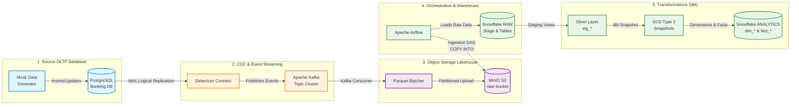

# 🏦 Banking Modern Data Stack (MDS)

[](https://github.com/Vinay9222/banking-modern-datastack/actions/workflows/ci.yml)
[](https://www.python.org/downloads/)
[](https://www.postgresql.org/)
[](https://kafka.apache.org/)
[](https://debezium.io/)
[](https://min.io/)
[](https://airflow.apache.org/)
[](https://www.snowflake.com/)
[](https://www.getdbt.com/)
[](https://github.com/astral-sh/ruff)

An end-to-end, enterprise-grade **Event-Driven Modern Data Platform** designed for high-throughput banking transactions. This repository demonstrates how to capture real-time OLTP changes with **Debezium Change Data Capture (CDC)**, stream events through **Apache Kafka**, persist raw partitioned data in a **MinIO S3 Data Lake**, orchestrate micro-batch ingestion into **Snowflake** using **Apache Airflow**, and transform data into analytics-ready data marts using **dbt** with **Slowly Changing Dimensions (SCD Type 2)**.

---

## 🏛️ Architecture Overview



---

## 🧩 Key Architecture Components

| Layer | Technology | Role & Description |
| :--- | :--- | :--- |
| **Source OLTP** | PostgreSQL 15 | Transactional core with relational tables: `customers`, `accounts`, `transactions`. Configured with logical WAL replication. |
| **CDC Engine** | Debezium Connect 2.2 | Monitors Postgres write-ahead logs (`pgoutput`) and emits row-level change events in near real-time. |
| **Message Broker**| Apache Kafka + Zookeeper | Distributed event log providing fault-tolerant buffering and pub/sub topics per source table. |
| **Lake Storage** | MinIO (S3-Compatible) | Scalable object store holding partitioned raw Parquet files (`{table}/date=YYYY-MM-DD/*.parquet`). |
| **Orchestration** | Apache Airflow 2.9.3 | Manages scheduled micro-batch data loading from MinIO to Snowflake and triggers dbt snapshots & runs. |
| **Data Warehouse**| Snowflake | Scalable cloud warehouse separating ingestion (`RAW`) from analytics (`ANALYTICS`). |
| **Transformations**| dbt Core + dbt-snowflake | Implements Medallion Architecture: source deduplication, SCD Type 2 dimension tracking, and incremental transaction facts. |
| **CI / CD** | GitHub Actions | Automated linting (Ruff), unit testing (Pytest), dbt compilation, and production continuous deployment. |

---

## 📁 Repository Structure

```text
banking-modern-datastack/
├── .github/
│   └── workflows/
│       ├── ci.yml                     # CI workflow (Ruff, Pytest, dbt compile)
│       └── cd.yml                     # Production deployment workflow
├── banking_dbt/                       # dbt project directory
│   ├── dbt_project.yml                # dbt project configuration
│   ├── profiles.yml                   # Snowflake profiles (env var driven)
│   ├── profiles.yml.example           # Reference profiles template
│   ├── models/
│   │   ├── source.yml                 # Source declarations (Snowflake RAW)
│   │   ├── staging/                   # Silver Layer (deduplicated views)
│   │   │   ├── schema.yml             # Staging tests and column definitions
│   │   │   ├── stg_accounts.sql
│   │   │   ├── stg_customers.sql
│   │   │   └── stg_transactions.sql
│   │   └── marts/                     # Gold Layer (star schema)
│   │       ├── schema.yml             # Marts tests and relational integrity
│   │       ├── dimensions/
│   │       │   ├── dim_accounts.sql   # SCD2 Dimension: Accounts
│   │       │   └── dim_customers.sql  # SCD2 Dimension: Customers
│   │       └── facts/
│   │           └── fact_transactions.sql # Incremental Fact: Transactions
│   └── snapshots/
│       ├── accounts_snapshot.sql      # dbt SCD2 snapshot logic for accounts
│       └── customers_snapshot.sql     # dbt SCD2 snapshot logic for customers
├── consumer/
│   └── kafka_to_minio.py              # Kafka consumer to Parquet MinIO writer
├── data-generator/
│   └── faker_generator.py             # Realistic banking transaction generator
├── docker/
│   └── dags/                          # Airflow DAG definitions
│       ├── minio_to_snowflake_dag.py  # MinIO to Snowflake RAW ingestion DAG
│       └── scd_snapshots.py           # dbt snapshots & marts execution DAG
├── kafka-debezium/
│   └── generate_and_post_connector.py # Debezium connector registration script
├── postgres/
│   └── schema.sql                     # PostgreSQL banking OLTP schema
├── tests/                             # Unit tests for CI verification
│   ├── test_generator_utils.py        # Generator logic validation
│   └── test_pipeline_configs.py       # Configuration and schema assertions
├── .env.example                       # Environment configuration template
├── .gitignore                         # Comprehensive Git ignore rules
├── docker-compose.yml                 # Container orchestration for all stack services
├── dockerfile-airflow.dockerfile      # Custom Airflow image with dbt-snowflake
├── requirements.txt                   # Project Python dependencies
└── README.md                          # Project documentation
```

---

## ⚡ Quickstart Guide

### 1. Prerequisites
- [Docker & Docker Compose](https://docs.docker.com/get-docker/) installed
- [Python 3.10+](https://www.python.org/) installed
- Active [Snowflake](https://www.snowflake.com/) trial or production account

### 2. Clone & Environment Setup
Clone the repository and set up your local environment file:

```bash
git clone https://github.com/Vinay9222/banking-modern-datastack.git
cd banking-modern-datastack

# Copy example environment configuration
cp .env.example .env

# Create and activate Python virtual environment
python -m venv .venv
source .venv/bin/activate  # On Windows: .venv\Scripts\activate
pip install -r requirements.txt
```

Update `.env` with your Snowflake credentials (`SNOWFLAKE_ACCOUNT`, `SNOWFLAKE_USER`, `SNOWFLAKE_PASSWORD`, etc.).

### 3. Launch Docker Services
Start the containerized modern data stack:

```bash
docker compose up -d
```

Verify that all services are healthy:
- **Airflow Webserver:** [http://localhost:8080](http://localhost:8080) (Default user: `admin` / `admin`)
- **MinIO Console:** [http://localhost:9001](http://localhost:9001) (Default user: `minioadmin` / `minioadmin`)
- **Debezium Connect:** [http://localhost:8083](http://localhost:8083)
- **PostgreSQL:** `localhost:5432`

### 4. Initialize PostgreSQL Schema
Apply the banking database schema:

```bash
# Execute schema.sql inside the banking postgres container
docker exec -i banking-postgres psql -U postgres -d banking < postgres/schema.sql
```

### 5. Register Debezium CDC Connector
Deploy the PostgreSQL CDC connector to Debezium Connect:

```bash
python kafka-debezium/generate_and_post_connector.py
```

### 6. Start the Mock Data Generator
Generate realistic synthetic banking records (customers, accounts, deposits, withdrawals, transfers):

```bash
# Continuous stream mode (generates batches every 2 seconds)
python data-generator/faker_generator.py

# Or run a single batch iteration:
python data-generator/faker_generator.py --once
```

### 7. Run the Kafka to MinIO Consumer
Consume CDC events from Kafka topics and write partitioned Parquet files to MinIO:

```bash
python consumer/kafka_to_minio.py
```

### 8. Trigger Airflow DAGs & dbt Transformations
1. Open the [Airflow UI](http://localhost:8080) and unpause:
   - `minio_to_snowflake_banking`: Batches Parquet files from MinIO into Snowflake `RAW` tables.
   - `SCD2_snapshots`: Runs dbt snapshots and builds dimensional models.
2. Alternatively, execute dbt models locally:

```bash
cd banking_dbt
dbt deps
dbt snapshot
dbt run
dbt test
```

---

## 📊 Data Modeling & Medallion Architecture

```text
  ┌──────────────────────────────────────────────────────────┐
  │                       BRONZE LAYER                       │
  │  Raw ingested Parquet payloads loaded into Snowflake     │
  │  Tables: RAW.CUSTOMERS, RAW.ACCOUNTS, RAW.TRANSACTIONS   │
  └─────────────────────────────┬────────────────────────────┘
                                │
                                ▼
  ┌──────────────────────────────────────────────────────────┐
  │                       SILVER LAYER                       │
  │  Cleaned, cast, deduplicated views (window ranking)      │
  │  Models: stg_customers, stg_accounts, stg_transactions  │
  └─────────────────────────────┬────────────────────────────┘
                                │
                                ▼
  ┌──────────────────────────────────────────────────────────┐
  │                        GOLD LAYER                        │
  │  Slowly Changing Dimensions (SCD Type 2) & Star Schema   │
  │  - dim_customers  (tracks historical profile changes)    │
  │  - dim_accounts   (tracks historical balance & type)     │
  │  - fact_transactions (incremental financial fact table) │
  └──────────────────────────────────────────────────────────┘
```

---

## 🧪 Testing & Code Quality

The repository includes automated checks for code standards, configuration validity, and dbt schema assertions:

```bash
# Run Ruff code linter
ruff check .

# Run Pytest unit test suite
pytest tests/ -v

# Run dbt data tests
cd banking_dbt
dbt test
```

---

## 🔒 Security & Secrets Management
- All sensitive credentials are decoupled from source code and managed via `.env` files and GitHub Actions Secrets.
- Local runtime data (`docker/postgres/data/`, `docker/minio/data/`, `docker/logs/`, `banking_dbt/target/`) is strictly ignored from version control.
- `banking_dbt/profiles.yml` is dynamically configured using dbt environment variables (`env_var`).

---

## 🤝 Contributing
1. Fork the repository
2. Create a feature branch (`git checkout -b feature/amazing-feature`)
3. Commit your changes (`git commit -m 'feat: add amazing feature'`)
4. Push to the branch (`git push origin feature/amazing-feature`)
5. Open a Pull Request against the `main` branch

---

## 📄 License
This project is open-source and available under the [MIT License](LICENSE).
